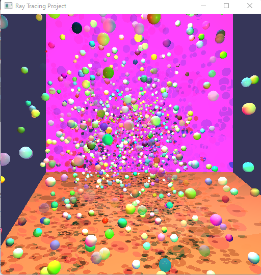

# Ray Tracer Project README

## OS and Hardware Specifications: 
	Operating System: Windows 11
	CPU: Intel Core i9-10850K
	GPU: NVIDIA GeForce RTX 3070

## Citations 

* [Ray Tracing in One Weekend](https://raytracing.github.io/books/RayTracingInOneWeekend.html#)  - Peter Shirley

* [Ray Tracing: The Next Week](https://raytracing.github.io/books/RayTracingTheNextWeek.html#) - Peter Shirley
* [ScratchaPixel](https://www.scratchapixel.com/index.php?redirect) 
* [Computer Graphics from Scratch](https://gabrielgambetta.com/computer-graphics-from-scratch/) - Gabriel Gambetta
* [Physically Based Rendering:From Theory To Implementation](https://pbr-book.org/) - Matt Pharr, Wenzel Jakob, and Greg Humphreys
* [Fresnel Equations, Schlick Approximation, Metals, and Dielectrics](http://psgraphics.blogspot.com/2020/03/fresnel-equations-schlick-approximation.html) - Peter Shirley
* [Stackoveflow](https://stackoverflow.com/)
 
	.Obj files:
	* [Teapot, Cow, Teddy Bear](https://groups.csail.mit.edu/graphics/classes/6.837/F03/models/)

	* [Monkey](https://github.com/kivy/kivy/tree/master/examples/3Drendering)
	

# Features Implemented
	Acceleration Structre: BVH
	Transformations: Camera Position and Direction adjustments
	Improved Quailty: *
	More Geometry: Partical System
	Techniques: *
	
	I altered the provided Assignment 5 solution and used an Object Oriented approach for the
	Ray Tracer Project. 

## Bounding Volume Hierarchy 
	The BVH is where the majority of my time was spent, however I believe it functions properly.
	There is a single BVH for the scene containing all of the objects, and the world bounding box.
	The BVH is built recursively using a Top-Down approach, and the mid point of a random axis as the 
	split condition. There is a minimum of 3 objects within a leaf node or a depth limit to avoid infitite
	recursion. The traversal method uses a stack to traverse the BVH, once a leaf node is reached
	it checks if the ray intersects the leafNodes bounding box, if it does it checks the bounding 
	boxes of all the objects, it they intersect it calls the objects intersection function. Mesh objects
	require their own BVH, BVH recrusive construction and BVH traversal method. 
	
	Classes: BoundingBox, BVH, Node 
	

### Sources used: 
* [Ray Tracing: The Next Week](https://raytracing.github.io/books/RayTracingTheNextWeek.html#) - Peter Shirley
* [Physically Based Rendering:From Theory To Implementation](https://pbr-book.org/) - Matt Pharr, Wenzel Jakob, and Greg Humphreys
* [Introduction to Acceleration Structures - ScratchaPixel](https://www.scratchapixel.com/lessons/3d-basic-rendering/introduction-acceleration-structure)

## Camera Position
	
There is a boolean variable in q1.cpp that determines if a camera is used in the scene. Changing the Camera Position is json2scene.cpp class in the json_2_cpp method.

	
Render Time: 1:02 min/sec

Camera Position: (0,8,-2,), Camera LookAt: (0.7, -0.6, -1) RenderTime: 0:27 min/sec

 

Camera Position: (0,0,2),  Canera LookAt:(0.5,0.5,-1) Render Time: 0:26 min/sec

Classes: Camera.cpp, Ray.cpp, Scene.cpp

Sources Used: 

[Generating Camera Rays](https://www.scratchapixel.com/lessons/3d-basic-rendering/ray-tracing-generating-camera-rays)

## Extra Geometry
## Wavefront .obj files 

	There is a clear visual bug where portions of the mesh are not being lit.

	Classes: Object.cpp
### Scene: cow
	
[Source](https://groups.csail.mit.edu/graphics/classes/6.837/F03/models/)

 No Camera Render Time: 0:38 min/sec

  

 Camera Pos:(0,2,2) Camera lookAt: (0.5,2,2)  Render time 0:29 min/sec

 

 ### Monkey & Teapot ( All reflective surface multile light sources)
 
 [Monkey](https://github.com/kivy/kivy/tree/master/examples/3Drendering) 

 [Teapot](https://groups.csail.mit.edu/graphics/classes/6.837/F03/models/)

 No Camera  Render Time: 4:30 min/sec

 

 Camera Position:(0,3,2), Camera lookAt:(2,3,-1)  Render Time: 2:57 min/sec
 
 

 ### Partical System 

	Simple partical system which generates spheres at random x,y,z values
	withl random material properties. Each Sphere has a 50% chance of being reflective, 40% tranmissive,
	and 15% refractive. For larger number of spheres I chose to lock the radius at 0.15, but for fewer spheres,
	the radius is also random. 

### Scene p

No Camera, no reflection, 50 spheres, random radius  Render Time: 0:37 min/sec

No Camera, reflection 50 Spheres, random radius  Render Time: 3:10 min/sec

 

No Camera, no reflection, 1000 spheres, 0.15 radius Render Time: 2:59 min/sec

 

No Camera, reflection, 1000 spheres, 0.15 radius (would not recommend trying)  Render Time: 17:11 min/sec

 

## Improved Quality and Techniques:
	Admittedly my biggest sturggle with this is project was time. Implmenting the BVH took too long and I underestimated the
	dificulty of this project. With that said I was unable to implement the Improved quailty or Technique portion of the project.
	

	
